# 07 — The 360° Architecture (end-to-end deep dive)

This is the **complete map** of CanonIQ: every layer, every component, the exact data
that flows between them, and *why* each piece exists. It is written to be read at three
altitudes:

- **Beginner** — read the prose and the diagrams; skip the code blocks. You'll come away
  able to draw the system on a whiteboard.
- **Practitioner** — read the "What it does" + "The flow" + "Rationale" parts of each
  component. You'll be able to extend the system.
- **Expert** — read the "Key code" and "Edge cases" notes. You'll understand every
  decision well enough to defend or change it.

> Already read [02 — Architecture, explained simply](02-architecture.md)? That's the
> postcard. This is the survey map.

---

## Table of contents

1. [The three altitudes (one diagram each)](#1-the-three-altitudes)
2. [The cross-cutting principles (and why)](#2-the-cross-cutting-principles)
3. [The nouns: data shapes that flow through the line](#3-the-nouns-data-shapes)
4. [The verbs: component-by-component deep dive](#4-the-verbs-component-deep-dive)
   - 4.1 [Connectors](#41-connectors--the-only-thing-that-touches-a-source)
   - 4.2 [Source-config loader](#42-source-config-loader--secrets-without-secrets)
   - 4.3 [Profiler](#43-profiler--describe-the-data)
   - 4.4 [Canonical schema registry](#44-canonical-schema-registry--the-target-shape)
   - 4.5 [Matchers + scoring + gating](#45-matchers--scoring--gating--the-brain)
   - 4.6 [Mapping engine](#46-mapping-engine--from-scores-to-decisions)
   - 4.7 [Optional AI semantic signal](#47-optional-ai-semantic-signal--the-pluggable-6th-sense)
   - 4.8 [Validation](#48-validation--build-and-run-the-checks)
   - 4.9 [Transform](#49-transform--reshape-into-the-model)
   - 4.10 [Drift detection](#410-drift-detection--did-the-next-file-change)
   - 4.11 [Config](#411-config--the-dials)
   - 4.12 [SDK facade + CLI](#412-sdk-facade--cli--the-two-control-panels)
5. [End-to-end trace with real numbers](#5-end-to-end-trace)
6. [Why this architecture scales](#6-why-this-architecture-scales)
7. [How to present it to anyone](#7-how-to-present-it-to-anyone)
8. [Appendix: glossary & file map](#8-appendix)

---

## 1. The three altitudes

### Altitude 1 — What the product *does* (one sentence + one picture)

> Take a messy file from someone else, figure out how its columns line up with *your*
> trusted model, clean the data into that shape, check it against rules, and warn you
> when a future file arrives shaped differently.

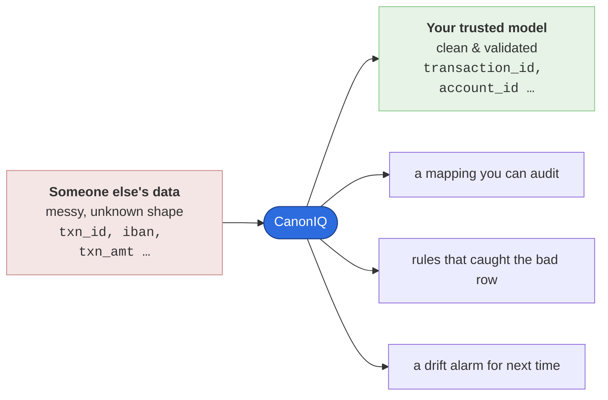

### Altitude 2 — The assembly line (the pipeline)

Each station does **one** job and hands a typed object to the next. Nothing skips ahead.

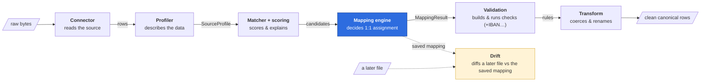

The whole line is wrapped by **two thin control panels** that call the *same* engine:

- the **SDK** — `from canoniq import CanonIQ` (for code)
- the **CLI** — `canoniq …` (for the terminal)

### Altitude 3 — The layered package architecture (the dependency rule)

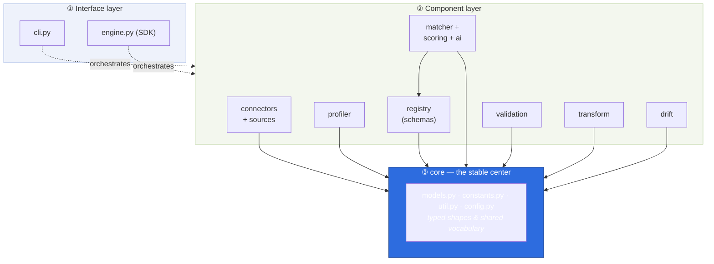

> **Read the arrows as "depends on / calls."** Everything points **inward toward `core`** —
> no inner ring is allowed to know about an outer ring. That one rule is what keeps the
> system changeable.

**Why a layered ("hexagonal / ports-and-adapters") design?** Because the *valuable* part —
the matching intelligence — must never depend on *where the data came from* or *where it's
going*. Connectors are "adapters" on the edge; `core` is the stable center. You can replace
any edge without touching the brain.

---

## 2. The cross-cutting principles

Five decisions are baked into every file. Understanding them up front explains 90% of the
"why did they write it this way?" questions.

| Principle | What it means in code | Why it matters |
|---|---|---|
| **Local-first** | The core makes *zero* network calls. The optional AI adapter is the only thing that can reach out, and only when explicitly configured. | Trust. You can run CanonIQ on regulated data (PHI, financial) and *prove* nothing left the machine. |
| **Determinism** | Same input + same config → byte-identical output. Tie-breaks are explicit and total (e.g. sort by `(confidence, alias_hit, name_sig, -position)`). | Auditability and golden-file testing. A reviewer can re-run and get the same answer. |
| **Explainability** | Every score carries `reasons` (human text) and `signals` (the raw numbers). No hidden state. | A human can *audit a single mapping* and agree or override — the safety valve. |
| **Immutability** | Models are Pydantic with `extra="forbid"`. Config changes go through `with_overrides()` which returns a *new* object. The engine never mutates the caller's config. | No spooky action at a distance; safe to share objects across threads/requests. |
| **Boundaries** | Connectors are the *only* code that touches a source; the profiler only sees `list[dict]`. The matcher only sees typed profiles + schema. | Each kind of change is isolated to exactly one place (see §6). |

Two of these are worth a closer look because they show up constantly:

**Determinism in practice** — see `combine_confidence` in `scoring/confidence.py`: weights are
*normalized over the active signals* (`weight / total_weight`). This is what lets the optional
semantic signal be switched on without re-tuning the other five — the math re-balances itself.

```python
active = {k: w for k, w in weights.items() if w > 0.0}
total_weight = sum(active.values()) or 1.0
score = sum((w / total_weight) * signals.get(k, 0.0) for k, w in active.items())
return max(0.0, min(1.0, round(score, 4)))   # clamp + round → stable
```

**Explainability in practice** — a `MappingSuggestion` is never just a number:

```json
{ "source_field": "iban", "canonical_field": "account_id", "confidence": 0.90,
  "status": "auto_approved",
  "reasons": ["'iban' is a declared alias of 'account_id'", "name similarity 1.00",
              "types match (string)", "value pattern 'iban_like' matches format 'iban'"],
  "signals": {"alias": 1.0, "name": 1.0, "type": 1.0, "pattern": 1.0, "range": 0.0} }
```

---

## 3. The nouns: data shapes

Before the verbs, learn the nouns. Five Pydantic models (`core/models.py`) are the
**contracts** that flow down the assembly line. If you know these, the SDK reads like the
diagram in §1.

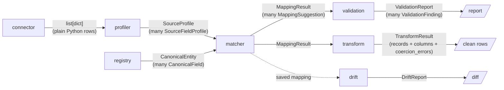

| Model | Role | Key fields (the ones that matter) |
|---|---|---|
| `SourceFieldProfile` | One column, described | `inferred_type`, `null_rate`, `unique_rate`, `patterns[]`, `min/max`, `enum_candidates`, `pii_flags[]`, `position`, `declared_type` |
| `SourceProfile` | A whole sampled file | `fields[]`, `row_count_sampled`, `source_metadata`, version stamps |
| `CanonicalField` | One target slot | `type`, `required`, `aliases[]`, `enum`, `format`, `min/max`, `pii`, `semantic_tags[]`, `standard` |
| `CanonicalEntity` | Your model (from YAML) | `domain`, `entity`, `version`, `primary_key[]`, `fields{}` |
| `MappingSuggestion` | One scored guess | `source_field`, `canonical_field`, `confidence`, `status`, `reasons[]`, `signals{}` |
| `MappingResult` | All the guesses | `canonical{}`, `mappings[]`, plus `approved_mappings()` helper |

> **Why Pydantic v2 with `extra="forbid"`?** Two reasons. (1) **Validation at the boundary** —
> a malformed schema or profile fails loudly at construction, not three stations later. (2)
> **Stable JSON** — every output `model_dump()`s to clean, diffable JSON, which is what makes
> golden-file tests and audit logs possible.

One subtle but important field: `MappingSuggestion.signals` is enriched by the mapping engine
with `_inferred_type`. That's how **drift detection later knows the old type of each column
without keeping the old file around** — the type travels inside the saved mapping.

---

## 4. The verbs: component deep dive

Each component below follows the same four-part shape: **What it does → The flow → Rationale →
Extension point**. Read top-to-bottom for the full tour, or jump to one.

### 4.1 Connectors — the only thing that touches a source

**What it does.** Reads a physical source (CSV/JSON/JSONL today) and returns rows in *one*
internal format: `list[dict[str, Any]]`, plus a metadata dict. That's the entire contract.

**The flow.**
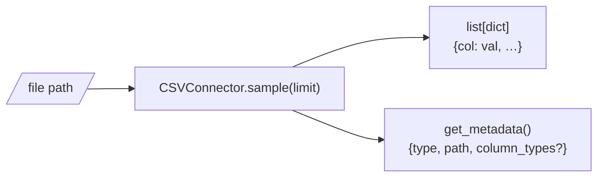

**Key code** — the abstract base is just four methods (`connectors/base.py`):
```python
class BaseSourceConnector(ABC):
    def test_connection(self) -> bool: ...
    def list_entities(self) -> list[str]: ...
    def sample(self, entity: str, limit: int = 1000) -> list[dict[str, Any]]: ...
    def get_metadata(self, entity: str) -> dict[str, Any]: ...
```

**Rationale.** This is **the single most important boundary in the system.** Because
everything downstream consumes plain rows, adding Postgres or S3 later means writing *one
new connector* — the profiler, matcher, validator, and transform never change. Enterprise
connectors (Parquet, Postgres, BigQuery, Snowflake, S3, …) ship as **placeholders** that
raise a clear `NotImplementedError` naming the target version and the `pip install` extra
that will enable them. That keeps the core dependency footprint tiny while wiring the
extension points so future releases install cleanly.

**Extension point.** Subclass `BaseSourceConnector`, register it, and you're done.
See [docs/connectors.md](../connectors.md).

---

### 4.2 Source-config loader — secrets without secrets

**What it does.** Instead of passing a file path, you can point CanonIQ at a small YAML
"source config" that describes *how to reach* a source — and resolves any `${ENV}` tokens
from the environment at load time.

**The flow.**
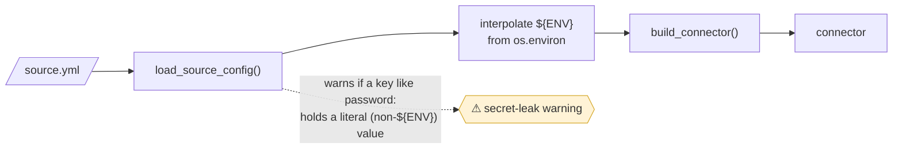

**Key code** (`sources/config_loader.py`): a regex `\$\{([A-Z0-9_]+)\}` is resolved against
`os.environ`; a referenced-but-unset variable raises `SourceConfigError` (fail fast). A
separate pass warns when a secret-ish key (`password`, `token`, `api_key`, …) contains an
inline literal.

**Rationale.** **No credential ever lives in the repo or a config file.** This is a hard
security requirement (see the PRD and `rules/common/security.md`): secrets come from the
environment, configs reference them by name. The inline-secret warning is a guardrail for
humans who paste a password by habit.

---

### 4.3 Profiler — describe the data

**What it does.** Turns `rows + metadata` into a `SourceProfile`: per-column statistics,
inferred types, value patterns, and PII/PHI flags. It is **completely source-agnostic** —
it never knows or cares which connector produced the rows.

**The flow** (per column):
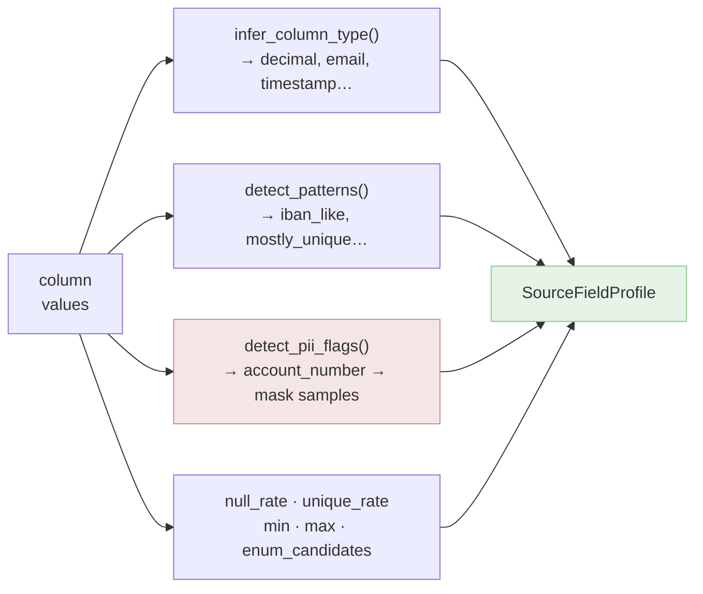

**Three sub-engines, each with a clear rule:**

1. **Type inference** (`type_inference.py`) — `infer_value_type` checks one value against an
   *ordered* regex cascade (email → currency code → percent → int → decimal → bool →
   datetime → date → json/array → string; first match wins). `infer_column_type` then takes
   the **most common verdict, with a precedence tie-break** toward the more specific type, and
   has special handling for "all integers stays integer; int+decimal → decimal" and "long
   strings → text". *Rationale: per-value voting is robust to a few dirty cells; precedence
   stops a single ambiguous value from down-grading the column.*

2. **Pattern detection** (`pattern_detection.py`) — runs many predicates (IBAN-like, GTIN-like,
   UUID-like, currency-code-like, enum-like, mostly-unique, high-null-rate, …) and keeps a
   pattern only if **≥90%** of values match (95% for identifiers). *Rationale: patterns are
   the bridge between "what the data looks like" and "what the canonical field expects"
   (see the pattern matcher in §4.5). A high threshold avoids false positives.*

3. **PII/PHI detection** (`pii_detection.py`) — flags from both the **field name** (keyword map:
   `ssn`/`mrn`/`iban`/…) and the **values** (SSN regex, IP regex, email regex). High-sensitivity
   flags (`national_id`, `mrn`, `account_number`) — plus email/name/dob/address — trigger
   **masking of sample values** (`mask_value`) before they're stored.

**Rationale for the whole stage.** Profiling is where **privacy is enforced at the earliest
possible point.** Sample values that could leak PII are masked *before* they enter a
`SourceProfile`, so they can't end up in a profile file, a log, or a UI downstream — and they
can never reach an external AI provider (the AI adapter only ever sees field *names* and
schema text). Masking-on-by-default is the privacy invariant the rest of the system relies on.

**Edge case worth knowing.** Column order is preserved by first-seen order across the sample
(`position`), so output stays stable and readable even for JSON sources with irregular keys.

---

### 4.4 Canonical schema registry — the target shape

**What it does.** Loads your canonical model from YAML into a validated `CanonicalEntity`.
This is the *only* thing you write to onboard a new domain — **no code.**

**Key code** (`registry/canonical_schema.py`): validates required top keys
(`domain/entity/version/fields`), checks every field `type` against `CANONICAL_TYPES`, checks
`pii` against `PII_LEVELS`, and verifies `primary_key` references real fields — raising
`CanonicalSchemaError` with an actionable message on any problem.

**Rationale.** The schema is rich on purpose. Each `CanonicalField` can declare `aliases`
(drives the alias signal), `format` (drives pattern matching *and* checksum validation),
`enum`, `min/max` (drives range matching and range rules), `semantic_tags`, and a `standard`
mapping (e.g. "this maps to ISO 20022 / FHIR / GS1"). **The schema is simultaneously the
matching hint, the validation contract, and the standards documentation.** One YAML file,
three jobs.

**Extension point.** A new industry = a new YAML schema + synthetic example data. See
[docs/domain_packs.md](../domain_packs.md).

---

### 4.5 Matchers + scoring + gating — the brain

**What it does.** For each `(source_field, canonical_field)` pair, runs **five independent
matchers**, each returning `(score ∈ [0,1], reason)`. The scores are combined into one
confidence number, which a threshold turns into a status.

**The five signals** (and the rationale for each):

| Signal | Weight | What it measures | Example reason |
|---|---|---|---|
| **alias** | 0.40 | Exact/normalized match of the source name against the canonical name or its declared aliases | `'iban' is a declared alias of 'account_id'` |
| **name** | 0.20 | Fuzzy string similarity (RapidFuzz token-set + plain ratio, + shared-token bonus) | `name similarity 0.86 ('txn_amt' ~ 'amount')` |
| **type** | 0.15 | Compatibility of inferred type vs canonical type (a partial-credit matrix: int→decimal = 0.85, etc.) | `types compatible (integer→decimal)` |
| **pattern** | 0.15 | Does a detected value pattern confirm the canonical `format` or `semantic_tags`? | `value pattern 'iban_like' matches format 'iban'` |
| **range** | 0.10 | Do observed min/max fall within canonical min/max? | `observed range [0,4] within [0,4]` |

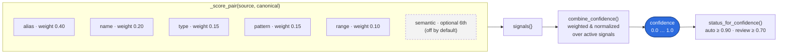

**Gating** (`status_for_confidence`): `≥0.90 → auto_approved`; `0.70–0.89 → requires_review`;
below → `low_confidence`; and anything under the `mapping_floor` (0.30) is treated as *no
candidate at all*.

**Rationale — why five small matchers instead of one ML model?**
- **Each is simple, independently testable, and individually explainable.** You can unit-test
  "does the IBAN pattern fire?" in isolation.
- **Transparency beats a black box** for an auditable system: the confidence is a *sum of
  reasons a human can read*, not an opaque probability.
- **Tunable without retraining** — weights live in config; change behavior with a YAML edit.
- **No training data required** — it works on day one for any domain, which is the whole point
  of a domain-agnostic engine.

This is the heart of the "deterministic, explainable" promise. The optional ML/embedding
signal (§4.7) is *added* to this ensemble, never a replacement.

---

### 4.6 Mapping engine — from scores to decisions

**What it does.** Scoring tells you how good *each pair* is. The mapping engine decides the
**actual assignment** — and enforces that each canonical field is claimed by **at most one**
source column.

**The algorithm** (`matcher/mapping_engine.py`), in three deterministic passes:

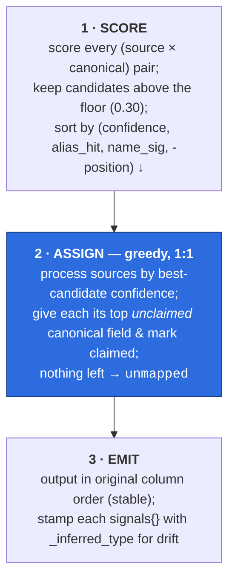

**Why greedy with that exact tie-break?** A 1:1 constraint prevents two source columns from
both claiming `amount`. Greedy-by-best-confidence is the natural choice and is **fully
deterministic** because the sort key is *total* (confidence, then alias-hit, then name
similarity, then position, then name) — there's never a coin-flip. It's not a global optimum
(that would be the Hungarian algorithm), but it's predictable, explainable, and fast, which
matches the product's priorities over a marginal accuracy gain.

**Rationale for the `_inferred_type` stamp.** Drift detection needs to know "what type was
this column last time?" Rather than persist the old profile, the engine **carries the type
inside the saved mapping**. The mapping file becomes self-sufficient for drift.

---

### 4.7 Optional AI semantic signal — the pluggable 6th sense

**What it does.** Adds an *optional* sixth signal, `semantic`, that scores how close the
*meaning* of a source field name is to a canonical field — using embeddings. **Off by
default.** When on, it slots into the same ensemble (§4.5) and the weight auto-balances.

**The architecture** (this is a clean Strategy + Registry pattern):

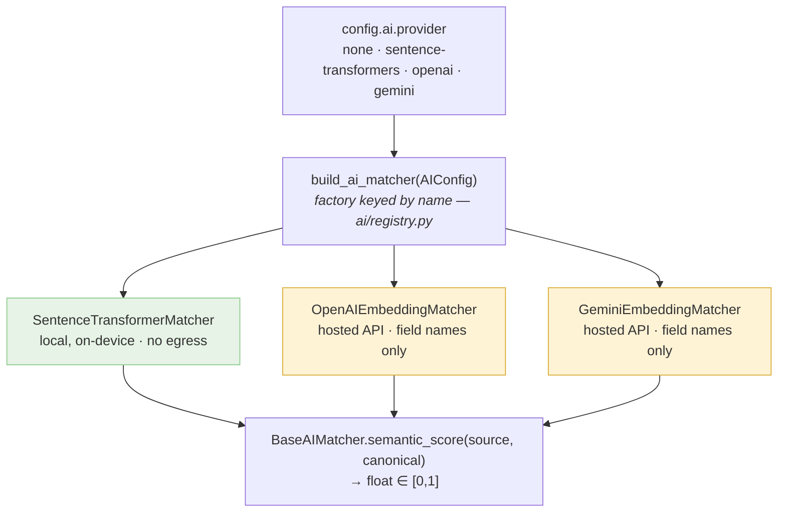

**Key code** — the contract is a single method (`ai/base.py`):
```python
class BaseAIMatcher(ABC):
    def semantic_score(self, source_field, canonical_field) -> float: ...
```
The shared `_text.py` helpers guarantee every adapter sends the **same minimal, PII-safe
text**: `source_text()` uses the field *name only*; `canonical_text()` uses name + aliases +
tags + description. Similarity is cosine mapped from `[-1,1]` to `[0,1]` (`cosine_to_unit`).

**Rationale — the layered design choices:**
- **Why optional & off by default?** To preserve the local-first guarantee. The deterministic
  five-signal core must always work with zero network calls.
- **Why a registry/factory keyed by name?** So enabling a model is a **one-line YAML change**
  (`provider: openai`) — no code. Custom/private models register via `register_ai_provider`.
- **Why stdlib `urllib`, not an SDK?** Zero new dependencies; the hosted adapters stay tiny and
  the network call is lazy so construction is offline-testable.
- **Why field *names* only to hosted providers?** Privacy. Masked PII/PHI sample values
  **never leave** — only column names + canonical schema text are embedded. Keys come from an
  env var (`api_key_env`), never config.
- **Why does Anthropic/Claude fail fast?** Claude has no first-party *embeddings* API, so
  `provider: claude` raises an actionable error instead of faking an endpoint. (Claude is
  reserved for a future optional *reasoning* stage that resolves the `requires_review` band.)

See [the AI section of the README](../../README.md#what-ai-model-powers-the-mapping) for the
provider/egress table.

---

### 4.8 Validation — build and run the checks

**What it does.** Two halves: (1) **generate** rules from the canonical schema + the mapping
(+ optionally the profile), and (2) **run** those rules against records to produce a report.

**The flow.**
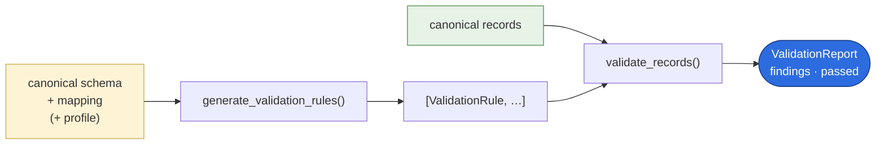

**Rule generation** (`rule_generator.py`) only emits rules for canonical fields that are
*actually mapped* (no point validating a field you didn't receive). From each field's metadata
it derives: `not_null` (if required), `valid_email`/`valid_datetime`, `valid_currency_code`,
`valid_checksum` (for IBAN/GTIN/NPI/LEI), `valid_format`, `range`, `allowed_values` (enum),
plus profile-aware advisories (`unique`, `unexpected_nulls`) and a `pii_present` info flag.

**The checksum detail that matters** (`formats.py`): formats aren't regex theater. An IBAN is
verified with the **real ISO 7064 mod-97 algorithm**; GTIN with its mod-10 check digit; NPI
with Luhn-over-`80840+digits` (the CMS spec); LEI with mod-97-10. *Rationale: "looks like an
IBAN" is worthless for catching transposed digits; the checksum actually catches bad data.*

**Severity semantics** (`validator.py`): only `error`-severity failures flip the report to
`passed=False`. `warning`/`info` findings are recorded but don't fail the dataset — so a human
sees advisories without blocking the pipeline. Empty values pass every rule except `not_null`
(absence is handled by `not_null`, not by every format check).

**Rationale.** Validation is generated *from the same schema that drove matching*, so the
contract and the checks can't drift apart. Unknown formats **degrade gracefully** (pass)
rather than crash — robustness over brittleness.

---

### 4.9 Transform — reshape into the model

**What it does.** Produces clean canonical records: rename mapped columns to canonical names,
coerce values toward the canonical type, drop unmapped columns (by default).

**Key code** (`transform/transformer.py`): output column order follows the *schema* when
provided (stable), `_coerce()` converts ints/decimals/percentages/booleans/currency codes and
**reports failures instead of swallowing them** (`coercion_errors`), and `approved_mappings()`
decides which mappings are usable (`include_review` lets you opt the review-tier in).

**Rationale.** Coercion is *lossless or reported* — a value that can't be coerced is kept
as-is and logged, never silently corrupted (honors the "never swallow errors" rule). Dropping
unmapped columns by default produces output that *exactly* matches your model; `keep_unmapped`
is there when you want a lossless passthrough.

---

### 4.10 Drift detection — did the next file change?

**What it does.** When a *later* file arrives, re-profile it and diff it against the saved
`MappingResult` + schema. Reports what changed *before* bad-shaped data flows through.

**The flow** (`drift/drift_detector.py`):
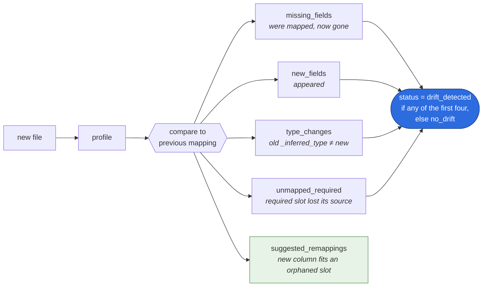

**The clever bit.** Drift re-runs the *same mapping engine* on the new profile, then compares.
Old types come from the `_inferred_type` stamp the engine left in the saved mapping (§4.6), so
**no old data file is needed.** "Suggested remappings" close the loop: if `iban` disappeared
but a new `account_iban` column now maps to the orphaned `account_id`, drift *proposes the
fix*, not just the problem.

**Rationale.** Schema drift is the #1 silent killer of data integrations. Catching it as a
typed, explainable report — with a proposed remap — turns a 2 a.m. incident into a code review.

---

### 4.11 Config — the dials

**What it does.** One immutable object (`config.py`) holds every tunable: thresholds
(`auto_approve_threshold`, `review_threshold`, `mapping_floor`), `weights`, sampling
(`sample_limit`, `sample_values`), `mask_pii`, and the nested `ai` block.

**Key behaviors:** `from_yaml()` loads it; `with_overrides()` returns a **new** instance
(never mutates). When an AI adapter is enabled, the engine turns on the semantic weight *on a
copy* of your config — your object is untouched (immutability, verifiably tested).

**Rationale.** Behavior changes should be **data, not code.** A reviewer can read one YAML file
and know exactly how the engine will score. Defaults live in `core/constants.py` so "the
local-first default" is a single source of truth.

---

### 4.12 SDK facade + CLI — the two control panels

**What it does.** `CanonIQ` (`engine.py`) is the public API: `profile_source`,
`suggest_mappings`, `generate_validation_rules`, `apply_mapping`, `detect_drift`, plus
`write_canonical_csv` / `write_json` helpers. The CLI (`cli.py`, Typer + Rich) is a thin
wrapper over the *same* engine.

**Key code** — the constructor wires the whole pipeline and handles the AI opt-in (note: no
mutation of the caller's config):
```python
if ai_matcher is None and self.config.ai.enabled:
    ai_matcher = build_ai_matcher(self.config.ai)
    if self.config.weights.get("semantic", 0.0) <= 0.0:
        new_weights = {**self.config.weights, "semantic": self.config.ai.weight}
        self.config = self.config.with_overrides(weights=new_weights)
```

**Rationale.** One engine, two faces. **Anything you can do in the terminal you can do in
code**, because the CLI never contains logic the SDK lacks — it only parses args, calls the
engine, and renders. `profile_source` dispatches on file extension; everything else takes a
schema path and returns a typed model. The facade is the *only* place that does file I/O for
outputs, keeping the inner layers pure.

---

## 5. End-to-end trace

Here is one row of the bundled **finance** example traveling the entire line, with the actual
numbers. Run it yourself: `python examples/finance/demo.py`.

> **INPUT ROW (messy):** `txn_id=TXN1001` · `iban=GB82WEST12345698765432` ·
> `txn_amt=250.00` · `currency=GBP` · `drcr=DBIT` · `posted_at=2026-01-04T09:15:00Z`

```mermaid
sequenceDiagram
    autonumber
    participant C as ① Connector
    participant P as ② Profiler
    participant M as ③ Match + Score
    participant E as ④ Map Engine
    participant V as ⑤ Validation
    participant T as ⑥ Transform
    participant D as ⑦ Drift

    C->>P: CSVConnector.sample()<br/>[{"txn_id":"TXN1001","iban":"GB82…", …}]
    Note over P: iban → string, patterns=[iban_like], pii=[account_number] (masked)<br/>txn_amt → decimal [min,max], patterns=[decimal, positive_number]<br/>currency → currency_code, patterns=[currency_code_like, enum_like]<br/>posted_at → timestamp, patterns=[timestamp_iso]
    P->>M: SourceProfile
    Note over M: iban → account_id: alias=1.0, type=1.0, pattern=1.0 (iban_like✓iban)<br/>⇒ confidence 0.90 ⇒ auto_approved<br/>drcr → direction: alias=1.0(declared), pattern=0.7(enum)<br/>⇒ 0.85 ⇒ requires_review
    M->>E: scored suggestions
    Note over E: greedy 1:1 assignment ⇒ 5 auto_approved, 1 requires_review<br/>each stamped with _inferred_type for future drift
    E->>V: MappingResult
    Note over V: generate ⇒ 11 rules (account_id:valid_checksum(iban),<br/>amount_currency:valid_currency_code, direction:allowed_values[debit,credit])<br/>run ⇒ IBAN mod-97 passes; a transposed-digit IBAN would FAIL here
    V->>T: ValidationReport (passed)
    Note over T: rename + coerce ⇒ transaction_id=TXN1001 · account_id=GB82… ·<br/>amount=250.00 · amount_currency=GBP · direction=debit ·<br/>booking_datetime=2026-01-04T09:15:00Z
    T->>D: canonical records
    Note over D: later file renamed a column ⇒ status="drift_detected"<br/>+ suggested_remapping for the renamed column
```

The same thing in six lines of Python is in
[03 — Pipeline walkthrough](03-pipeline-walkthrough.md#the-same-thing-in-6-lines-of-python).

---

## 6. Why this architecture scales

The payoff of the layered, boundary-respecting design is **change isolation** — each kind of
change touches exactly one place:

| You want to… | You change… | You do **not** touch |
|---|---|---|
| Support a new data source (Postgres, S3) | one new **connector** | profiler, matcher, validation, transform |
| Onboard a new industry/model | one **YAML schema** (+ synthetic data) | any Python code |
| Tune matching behavior | **config** weights/thresholds (YAML) | any Python code |
| Add a smarter matching signal | one **AIMatcher** + `register_ai_provider` | the other five matchers |
| Add a new validation format | one validator in **formats.py** | rule generation logic |
| Audit any decision | read `reasons` / `signals` on a mapping | nothing — it's already there |

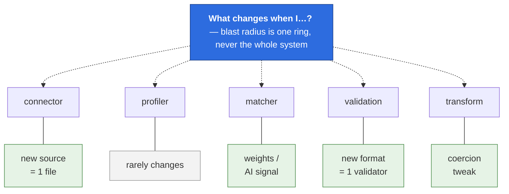

---

## 7. How to present it to anyone

Three ready-made framings for different rooms (pair with
[06 — Demoing to stakeholders](06-stakeholder-demo.md)).

**The 30-second elevator pitch (any audience):**
> "Onboarding someone else's data is slow because their columns never match yours. CanonIQ
> reads their file, *automatically* maps their columns to your model with a confidence score
> and a plain-English reason for every guess, cleans the data into your shape, validates it,
> and warns you when next month's file arrives shaped differently. It runs entirely on your
> machine — nothing is sent anywhere."

**The whiteboard sequence (technical audience)** — draw the §1 assembly line, then say one
sentence per box: *"Connector reads → profiler describes → matcher scores with five
explainable signals → engine assigns 1:1 → validation generates and runs checks including real
checksums → transform reshapes → drift watches the next file."* Then draw the §3 dependency
rings and deliver the punchline: *"everything points inward; the brain never knows where the
data came from, so any edge is replaceable."*

**The per-audience angle:**
- **Engineers** → the dependency rule (§1, altitude 3) and change-isolation matrix (§6).
- **Security/compliance** → local-first + masking-at-the-profiler + secrets-from-env (§2, §4.3, §4.2).
- **Data/ops leaders** → the five-signal *explainability* and the `requires_review` safety
  valve (§4.5) — "the machine is fast, the human stays in control."
- **Executives** → the use-case breadth (one engine, five industries) and the drift early-warning.

**Two soundbites that land:**
- *"Every guess comes with a reason you can read and a number you can audit."*
- *"Adding Postgres is one file. Adding an industry is one YAML. Tuning behavior is one config."*

---

## 8. Appendix

### Glossary
- **Canonical model / entity** — *your* trusted target shape, defined in YAML.
- **Profile** — the statistical description of an incoming file.
- **Signal** — one of the (up to six) matchers contributing to a confidence score.
- **Gating** — turning a confidence number into `auto_approved` / `requires_review` /
  `low_confidence` via thresholds.
- **Drift** — divergence between a new file and a previously saved mapping/schema.
- **Mapping floor** — the confidence below which a candidate is treated as "no candidate."

### File map (where each component lives)
```
canoniq/
├── engine.py              SDK facade (§4.12)
├── cli.py                 Typer CLI (§4.12)
├── config.py              tunables, AIConfig (§4.11)
├── core/
│   ├── models.py          the nouns (§3)
│   ├── constants.py       types, statuses, default weights/thresholds (§2)
│   └── util.py            normalize_name, tokens, now_iso
├── connectors/            data access; base + real (CSV/JSON/JSONL) + placeholders (§4.1)
├── sources/               source-config loader, ${ENV} interpolation (§4.2)
├── profiler/              type_inference, pattern_detection, pii_detection (§4.3)
├── registry/              canonical_schema loader, mapping registry (§4.4)
├── matcher/               alias/name/type/pattern/range + mapping_engine (§4.5–4.6)
├── scoring/               combine_confidence, status_for_confidence (§4.5)
├── ai/                    base, registry, sentence-transformer + embedding adapters (§4.7)
├── validation/            rule_generator, validator, formats (checksums) (§4.8)
├── transform/             transformer (§4.9)
└── drift/                 drift_detector (§4.10)
```

### Where to go next
- [02 — Architecture, explained simply](02-architecture.md) — the gentle version of this doc.
- [03 — Pipeline walkthrough](03-pipeline-walkthrough.md) — the same trace as §5, with prose.
- [docs/concepts.md](../concepts.md) — profiles, scoring, gating, drift in reference form.
- [docs/architecture.md](../architecture.md) — the terse module/data-flow reference.
- [docs/connectors.md](../connectors.md) / [docs/domain_packs.md](../domain_packs.md) — the two
  most common extension points.
