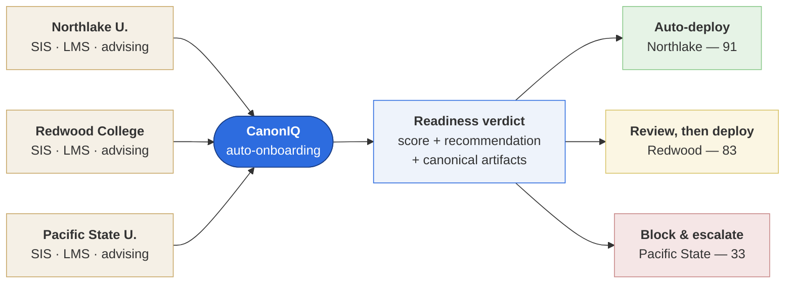
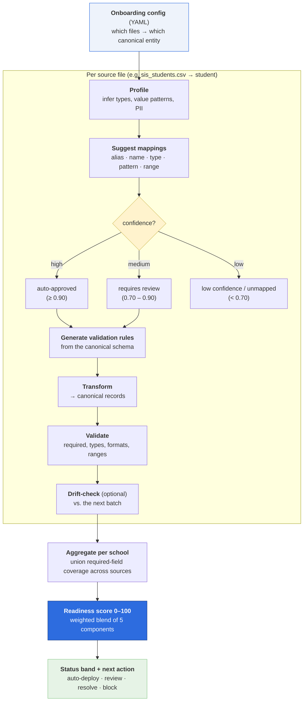
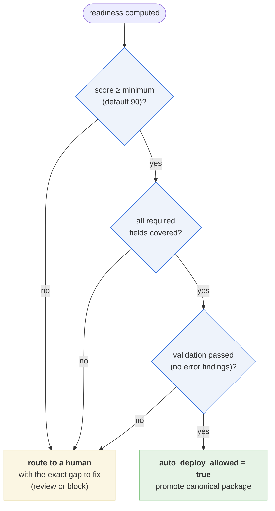

# CampusLaunch AI — Auto-Onboarding for Higher Education

A complete, runnable example of using **CanonIQ** to *auto-onboard* multiple data
providers — here, universities — by mapping each school's messy SIS/LMS/advising
exports into shared canonical models, validating them, checking for drift, and
scoring how **deployment-ready** each provider is.

> **The pitch.** CampusLaunch AI is a (fictional) advising platform. Every new
> school arrives with its own column names, file shapes, and quirks. Instead of an
> engineer hand-writing a bespoke integration per school, CampusLaunch points
> CanonIQ at each school's exports and gets back a **readiness score** and a
> **deployment recommendation** — *automatically*. Clean providers flow straight
> through; messy ones are flagged with exactly what a human needs to fix. This is
> how you onboard the 50th school as easily as the 1st.

CanonIQ never deploys anything. It produces a *readiness verdict* plus the
canonical artifacts (mappings, validation rules, transformed records) that a
downstream deploy step could consume. The decision to ship stays with you.

---

## What this example demonstrates

### The problem CanonIQ solves (stakeholder view)

Every school sends the same *kinds* of data — students, courses, advising — but in
its own column names, file shapes, and quirks. Hand-integrating each one is slow and
doesn't scale. CanonIQ turns that one-off engineering work into an **automated,
scored decision**: messy exports go in, a deployment-readiness verdict comes out,
and each school is routed to the right next step.



CanonIQ never deploys; it produces the **verdict plus the canonical artifacts** a
deploy step could consume. The decision to ship stays with you.

### The pipeline, end to end

For each school, CanonIQ runs the full pipeline **per source file**, then
**aggregates** the results into one readiness score for the school:



> Plain-text summary: `load config → profile → suggest mappings → auto-approve
> high-confidence → flag the rest for review → generate validation rules →
> transform → drift-check (optional) → score readiness → recommend a next action`.

### The auto-deploy gate

A school is cleared for auto-deploy **only if it clears every gate**. Any failure
routes it to a human with a specific reason — this is why Redwood (missing a
required field) and Pacific State (low score + drift) are held back even though the
pipeline ran successfully:



### The three schools

Three schools are included to show the full spectrum of outcomes:

| School | Profile | Outcome |
|---|---|---|
| **Northlake University** | Clean, well-named exports; complete data; stable schema | Ready for auto-deploy |
| **Redwood College** | Solid data, but an advising export is missing `advisor_id` and a couple of columns don't map | Ready with minor review |
| **Pacific State University** | Cryptic headers, **no email column at all**, and a "next batch" that has already drifted | Blocked |

### The core problem, made concrete

Every school sends the *same* student attributes under *different* column names.
That's the variance an engineer would otherwise reconcile by hand, per school,
forever. CanonIQ resolves it from the canonical schema's `aliases` — no per-school
code:

| Canonical field | Northlake | Redwood | Pacific State |
|---|---|---|---|
| `student_id` | `banner_id` | `student_number` | `person_uid` |
| `email` | `student_email` | `primary_email` | *(absent — flagged)* |
| `given_name` | `first_name` | `first_name` | `fname` |
| `family_name` | `last_name` | `last_name` | `lname` |
| `gpa` | `cumulative_gpa` | `overall_gpa` | `gpa_val` |
| `enrollment_status` | `status` | `enroll_status` | `enr_stat` |

Northlake's clean aliases map with high confidence; Pacific State's cryptic headers
(`gpa_val`, `enr_stat`, `prog`) fall to *low-confidence* or *unmapped* and are held
back — exactly the behavior you want from an automated gate.

---

## Folder layout

```
higher_ed_auto_onboarding/
├── README.md                     # you are here
├── demo_auto_onboard.py          # runs all three schools end-to-end
├── onboarding_configs/           # one YAML per school (the onboarding "plan")
│   ├── northlake_university.yml
│   ├── redwood_college.yml
│   └── pacific_state_university.yml
├── canonical/                    # the shared canonical models every school maps into
│   ├── canonical_student.yml
│   ├── canonical_course.yml
│   ├── canonical_degree_plan.yml
│   └── canonical_advising_interaction.yml
├── schools/                      # each school's raw, messy source exports (synthetic)
│   ├── northlake_university/
│   │   ├── sis_students.csv
│   │   ├── lms_activity.csv
│   │   ├── advising_notes.csv
│   │   └── sis_students_drift.csv   # a later batch, for drift detection
│   ├── redwood_college/  ...
│   └── pacific_state_university/  ...
└── output/                       # generated readiness reports land here (git-ignored)
```

All data is **synthetic** — no real students, no real PII. High-PII fields (e.g.
advising notes) are masked by CanonIQ's profiler by default.

---

## Run it

From the repository root, after `pip install -e .`:

```bash
# Option A — the guided demo (RECOMMENDED): a narrated, presentation-grade
# walkthrough — field-level mappings with reasons, per-source breakdown, readiness
# scoring math, the deployment package, a portfolio roll-up, and an ROI summary.
python examples/higher_ed_auto_onboarding/demo_auto_onboard.py

# Option B — the CLI, one provider at a time
canoniq onboard \
  --config examples/higher_ed_auto_onboarding/onboarding_configs/northlake_university.yml

# Option C — the CLI, every provider in the directory + a combined roll-up
canoniq onboard-batch \
  --config-dir examples/higher_ed_auto_onboarding/onboarding_configs \
  --combined-out examples/higher_ed_auto_onboarding/output/combined_readiness.json
```

The guided demo (Option A) is the best way to *see the value*: it walks the
CampusLaunch AI story, prints the pipeline, then for each school shows the actual
messy→canonical field mappings (with the reason for every decision), the readiness
breakdown, and the verdict — ending with a portfolio roll-up and an ROI estimate.

---

## Results (from the bundled synthetic data)

```
┌──────────────────────────┬───────┬─────────────────────────┬─────────────┐
│ school                   │ score │ status                  │ auto-deploy │
├──────────────────────────┼───────┼─────────────────────────┼─────────────┤
│ Northlake University     │    91 │ ready_for_auto_deploy   │ yes         │
│ Redwood College          │    83 │ ready_with_minor_review │ no          │
│ Pacific State University │    33 │ blocked                 │ no          │
└──────────────────────────┴───────┴─────────────────────────┴─────────────┘
  1 auto / 1 minor-review / 0 needs-review / 1 blocked  (3 total)
```

A few things worth noticing:

- **Northlake scores 91 and is cleared for auto-deploy** — every required field is
  covered (across the union of its SIS + LMS exports), validation passes, and its
  next batch shows no drift.
- **Redwood scores 83** but auto-deploy is **withheld**: its advising export is
  missing the required `advisor_id`, so `required_fields_covered = false`. The
  score is high enough to be promising, but the policy gate correctly holds it for
  a human.
- **Pacific State scores 33 and is blocked**: there is no email column anywhere in
  its student sources, many headers don't map, and its next batch has already
  drifted (columns added and removed).
- Even on clean data, CanonIQ is **conservative about auto-approval** — most exact
  alias matches still land in `requires_review` rather than `auto_approved`. That's
  by design: auto-approval is reserved for the highest-confidence matches, and the
  readiness score rewards review-grade mappings while keeping a human in the loop.

---

## How the readiness score works

The score is a weighted blend of five components (weights sum to 1.0):

| Component | Weight | Ratio measured |
|---|---:|---|
| Schema mapping coverage | 35% | mapped source fields ÷ total source fields |
| Required field coverage | 25% | required canonical fields covered ÷ required total |
| Validation rule coverage | 15% | passing validation findings ÷ total findings |
| Auto-approved mapping ratio | 15% | auto-approved mappings ÷ mapped fields |
| Drift status | 10% | drift-checked sources with no drift ÷ checked sources |

`readiness_score = round(Σ ratioᵢ × weightᵢ × 100)`

**Status bands:**

| Score | Status |
|---|---|
| 90–100 | `ready_for_auto_deploy` |
| 80–89 | `ready_with_minor_review` |
| 60–79 | `needs_mapping_review` |
| below 60 | `blocked` |

**Required-field coverage is computed per entity, using the union of every source
that targets it.** This matters: Northlake's `lms_activity.csv` only carries
`student_id`, `last_lms_login`, and `missing_assignments` — it has no email. On its
own it would "fail" required coverage for the student entity. But combined with
`sis_students.csv` (which has the email), the student entity is fully covered. CanonIQ
evaluates the entity, not the individual file.

### When is auto-deploy allowed?

```
auto_deploy_allowed = (readiness_score >= minimum_readiness_score)
                      AND (all required fields are covered)
                      AND (no critical/error-severity validation failures)
```

`minimum_readiness_score` (default **90**) and the two `require_*` switches live in
each config's `deployment:` block, so a provider can have its own gate.

---

## The onboarding config

Each school is described by one YAML file. Paths are resolved relative to the
config file, so configs and data travel together:

```yaml
provider:
  id: northlake_university
  name: Northlake University
  environment: staging
deployment:
  minimum_readiness_score: 90
  require_required_fields: true
  require_validation_pass: true
sources:
  - name: sis_students
    entity: student
    path: ../schools/northlake_university/sis_students.csv
    canonical: ../canonical/canonical_student.yml
    drift_path: ../schools/northlake_university/sis_students_drift.csv  # optional
  - name: lms_activity
    entity: student
    path: ../schools/northlake_university/lms_activity.csv
    canonical: ../canonical/canonical_student.yml
output:
  dir: ../output/northlake_university
```

A source maps **one file → one canonical entity**. Multiple sources may target the
same entity (e.g. SIS + LMS both feed `student`). Add `drift_path` to compare a
later batch against the mapping CanonIQ just learned.

---

## Example mappings CanonIQ discovers

A sample of the source→canonical mappings inferred from aliases, names, types,
and value patterns (no hand-written rules):

| School source column | → Canonical field |
|---|---|
| `banner_id`, `emplid`, `person_uid`, `student_number` | `student.student_id` |
| `student_email`, `email_address` | `student.email` |
| `first_name` / `last_name` | `student.given_name` / `student.family_name` |
| `cumulative_gpa`, `overall_gpa` | `student.gpa` |
| `status`, `student_status` | `student.enrollment_status` |
| `last_activity_at` | `student.last_lms_login` |
| `appointment_id` | `advising_interaction.interaction_id` |
| `meeting_datetime` | `advising_interaction.occurred_at` |
| `note_text` | `advising_interaction.notes` (masked, high-PII) |

---

## The readiness report

`onboard` writes one JSON report per provider (shape abbreviated):

```json
{
  "provider_id": "northlake_university",
  "provider_name": "Northlake University",
  "environment": "staging",
  "status": "ready_for_auto_deploy",
  "readiness_score": 91,
  "summary": {
    "total_fields": 18,
    "mapped_fields": 18,
    "auto_approved_mappings": 7,
    "requires_review": 11,
    "low_confidence": 0,
    "required_fields_covered": true
  },
  "component_scores": { "schema_mapping": { "ratio": 1.0, "weight": 0.35, "points": 35.0 }, "...": "..." },
  "sources": [ { "source": "sis_students", "entity": "student", "drift_status": "no_drift", "...": "..." } ],
  "deployment_recommendation": "All required fields are mapped with high confidence ...",
  "auto_deploy_allowed": true,
  "next_action": "auto_deploy"
}
```

`onboard-batch` additionally writes a `combined_readiness.json` roll-up counting
how many providers landed in each status band.

---

## Business value

Onboarding data partners is usually **bespoke engineering per partner**: read their
export, hand-map every column, write validation, test, repeat — then babysit it when
their schema changes. That cost scales linearly with the number of partners and is
the silent tax on every multi-tenant data platform.

What CanonIQ changes for CampusLaunch AI (real numbers from this example's data):

| | Without CanonIQ | With CanonIQ |
|---|---|---|
| New-school integration | Custom mapping code each time | **One YAML config** — no code |
| 55 source fields across 3 schools | Hand-mapped + validated (~14 h first pass) | Profiled & proposed **in seconds** |
| Human effort | Map everything from scratch | Review only the **~26 flagged** items; **15 auto-approve** untouched |
| Every decision | Tribal knowledge in someone's head | **Explained + auditable** (a reason per mapping) |
| A school renames a column | Pipeline silently breaks | **Drift detected**, remapping suggested |
| "Is this school safe to deploy?" | A judgment call | A **scored, gated verdict** (90/80/60 bands) |

The strategic shift: partner onboarding moves from **linear engineering cost** to a
**repeatable, config-driven, governed process** — the 50th school costs the same as
the 1st, and a non-engineer can read the readiness report and know exactly what's
blocking a deployment.

> Run `demo_auto_onboard.py` to see this quantified live (it prints the field counts,
> auto/review/held split, and an ROI estimate for the bundled cohort).

### How this applies to your domain

Nothing here is education-specific. Swap the canonical schemas and you have vendor
onboarding for a marketplace, partner-bank feeds for a fintech, or tenant data for a
SaaS product — same engine, same workflow. See the
[retail vendor example](../retail_vendor_onboarding/README.md) and the
domain-neutral [Auto-Onboarding Guide](../../docs/onboarding.md).

---

## Where the code lives

The reusable logic is a first-class part of the library, not example-only glue:

- `canoniq/onboarding/config.py` — config models + loader
- `canoniq/onboarding/readiness.py` — scoring weights, status bands, `compute_readiness`
- `canoniq/onboarding/orchestrator.py` — `onboard_provider` / `onboard_providers`
- `canoniq/onboarding/models.py` — the report Pydantic models

so you can call it directly:

```python
from canoniq.onboarding import onboard_provider

report = onboard_provider("path/to/provider.yml")
if report.auto_deploy_allowed:
    deploy(report)        # your code
else:
    notify_reviewer(report)
```
